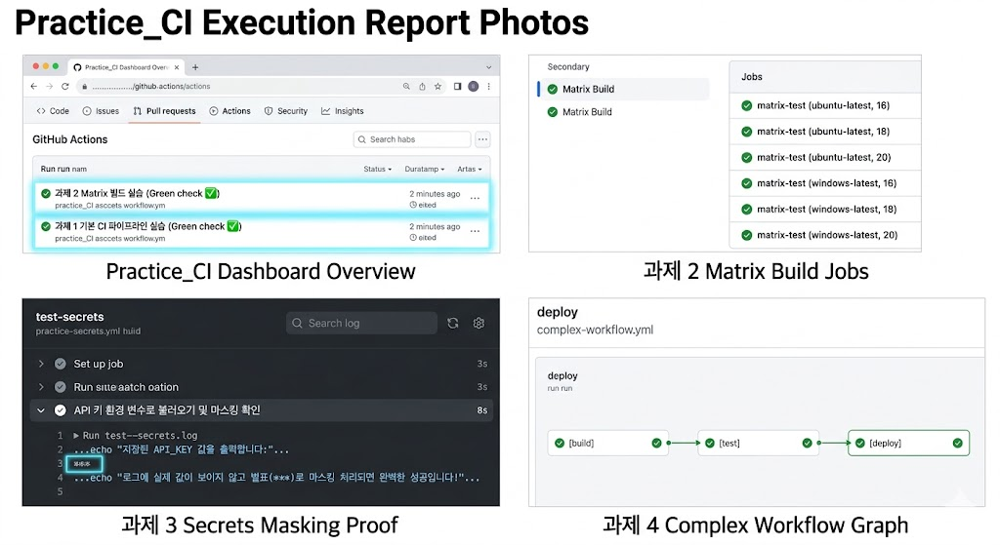

# 🛠️ [실습 보고서] GitHub Actions 기본 및 심화 파이프라인 구축

## 📌 과제 1: 기본 CI 구축 (Hello, CI Pipeline!)
* **목표:** 코드가 푸시될 때 자동으로 Lint(코드 검사)와 Test(단위 테스트)를 실행하는 기본 워크플로우 구축
* **구현 내용:** * Python 환경에서 `flake8`을 이용한 정적 코드 분석 수행
  * `pytest`를 활용한 자동화 단위 테스트 실행
* **결과:** 코드 업로드 시 깃허브 로봇이 자동으로 문법 오류와 논리적 오류를 검증하는 기초 자동화 환경 완성

## 📌 과제 2: Matrix 빌드 (Test Across Environments)
* **목표:** 단일 설정 파일로 다양한 운영체제 및 언어 버전에서의 크로스 플랫폼 호환성 검증
* **구현 내용:** * `strategy.matrix`를 활용하여 OS(`ubuntu-latest`, `windows-latest`)와 Node.js 버전(`16, 18, 20`) 조합
  * 총 6개(2x3)의 하위 Job을 병렬로 생성하여 동시 다발적인 테스트 진행
* **결과:** 다양한 환경에서의 동작 여부를 빠르고 정확하게 검증하는 Matrix 전략 확보

## 📌 과제 3: Secrets 활용 (Secure Your Secrets)
* **목표:** API 키나 비밀번호와 같은 민감한 데이터를 코드에 노출하지 않고 안전하게 관리
* **구현 내용:** * GitHub Repository `Secrets`에 `API_KEY` 등록
  * 워크플로우 파일 내에서 `env` 키워드를 사용해 환경 변수로 주입 (`${{ secrets.API_KEY }}`)
* **결과:** 실행 로그(Actions 탭)에서 실제 값이 노출되지 않고 별표(`***`)로 안전하게 마스킹(Masking) 처리됨을 확인

## 📌 과제 4: 복합 워크플로우 (Complex Workflow)
* **목표:** Job 간의 의존성 및 파일 전달을 포함한 실제 프로덕션 수준의 3단계 배포 파이프라인 구축
* **구현 내용:** * `build` $\rightarrow$ `test` $\rightarrow$ `deploy` 3단계 Job 구성 및 `needs` 키워드로 순차적 의존성 부여
  * `upload-artifact`와 `download-artifact`를 사용하여 빌드 결과물을 배포 단계로 전달
  * `if: github.ref == 'refs/heads/main'` 조건을 추가하여 `main` 브랜치에 푸시될 때만 최종 배포가 이루어지도록 제한
* **결과:** 빌드가 성공해야 테스트가 돌고, 테스트까지 완벽히 성공해야만 서버에 배포되는 견고한 자동화 로직 완성