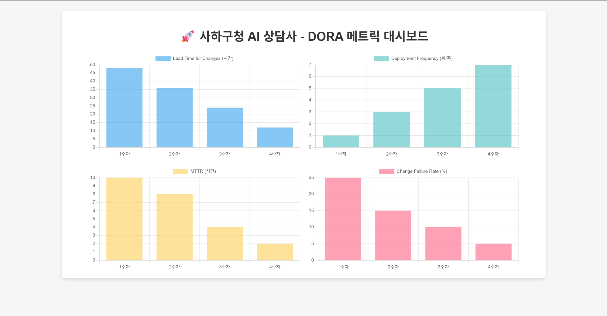

> 💡 **안내:** 본 README.md 문서는 과제 수행 및 문서화 과정에서 생성형 AI의 도움을 받아 작성되었습니다.

# 📊 [2주차] DORA 메트릭 수집 자동화

## 1. DORA 메트릭 대시보드 시안
Chart.js를 활용하여 구성한 DORA 4대 지표(Lead Time, Deployment Frequency, MTTR, Change Failure Rate) 대시보드 시안입니다.

## 2. 수집 자동화 파이프라인 개요 (선택 과제 포함)
본 프로젝트는 GitHub Actions를 활용하여 주기적으로 DORA 메트릭을 수집하고 리포트를 생성하도록 구성되었습니다.
* **데이터 수집 로직:** `collect_metrics.py` 스크립트 실행
* **아티팩트 저장:** 수집된 지표 데이터는 `dora_metrics.json` 형태로 추출 및 보관됩니다.