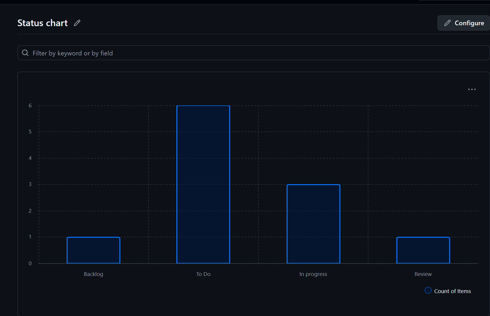

> 💡 **안내:** 본 README.md 문서는 과제 수행 및 문서화 과정에서 생성형 AI의 도움을 받아 작성되었습니다.

# 📋 [3주차] GitHub Projects 계획·추적 체계 구축

## 1. GitHub Project 칸반 보드
* **프로젝트 URL:** (https://github.com/users/hellokack/projects/3)
* **상태 컬럼 구성:** Backlog, To Do, In Progress, Review, Done 컬럼을 설정하여 이슈의 흐름을 한눈에 파악할 수 있도록 구성하였습니다.

## 2. 이슈 및 마일스톤 운영
* Bug 및 Feature 템플릿을 직접 제작하여 적용하였습니다.
* 총 10개의 백로그(이슈)를 생성하였으며, Sprint 1과 Sprint 2 마일스톤을 할당하여 체계적인 스프린트 운영 계획을 수립하였습니다.

## 3. (선택과제) 메트릭 분석
* GitHub Projects의 Insights 기능을 활용하여 프로젝트 진행률 및 상태를 시각화하였습니다. (Cycle Time 및 Burndown 추적 기반 마련)
