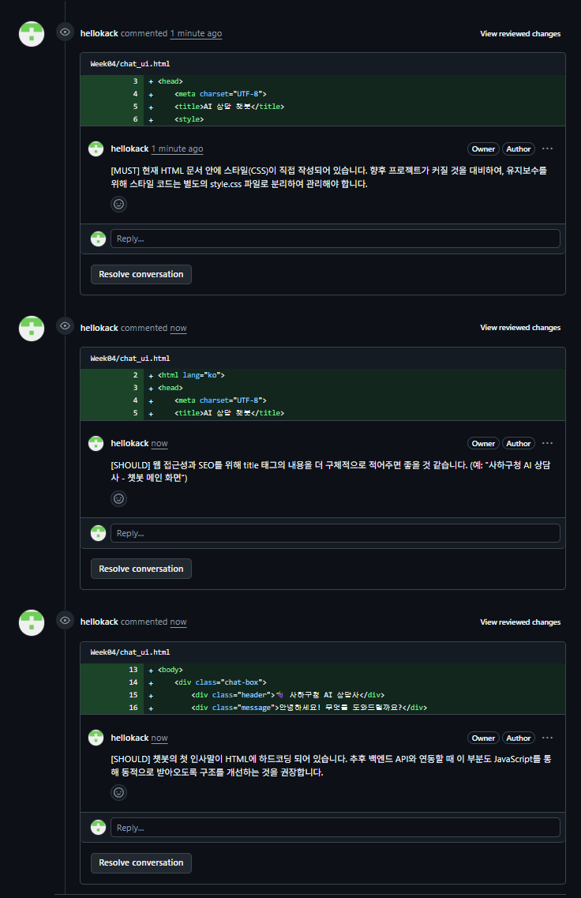

> 💡 **안내:** 본 README.md 문서는 과제 수행 및 문서화 과정에서 생성형 AI의 도움을 받아 작성되었습니다.

# 🍇 [4주차] GitHub Flow 및 코드리뷰 협업 실습

## 1. Feature 브랜치 및 PR 생성 (Conventional Commits)
* **PR 링크:** (https://github.com/hellokack/sahahaha/pull/14)
* `feat/chat-ui` 등의 브랜치를 생성하여 작업 후, Conventional Commits 규칙(feat, fix 등)을 준수하여 PR을 생성하였습니다.

## 2. 코드 리뷰 수행
* PR 리뷰 시 `[MUST]`, `[SHOULD]` 태그를 활용하여 구조화된 피드백을 3건 이상 남겼습니다.

## 3. (선택과제) 팀 협업 환경 세팅 완료
* `pull_request_template.md` (PR 템플릿) 적용 완료
* `CODEOWNERS` 설정 완료
* `CONTRIBUTING.md` (기여 가이드라인) 작성 완료
* 브랜치 보호 규칙(Branch Protection Rule) 설정 완료